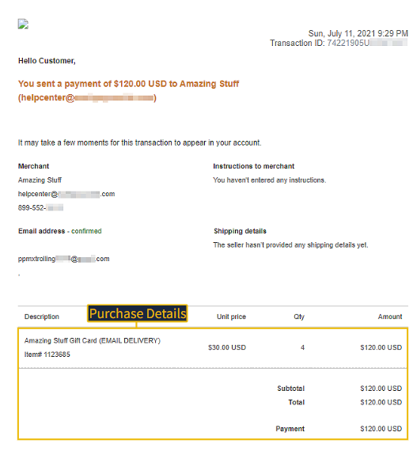
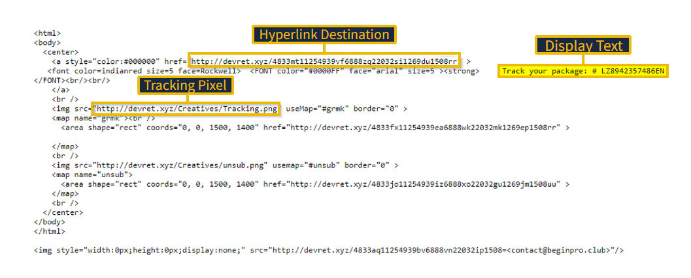
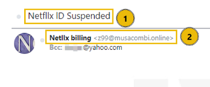

# Phishing Emails in Action – TryHackMe

## Overview

This lab focused on analyzing phishing emails and identifying common social engineering techniques used by attackers. Through the examination of real-world phishing samples, the exercise demonstrated how threat actors use spoofed identities, malicious links, credential harvesting pages, tracking pixels, and malicious attachments to deceive users.

The objective was to investigate email headers, sender information, hyperlinks, and attachments to determine whether a message was legitimate or malicious.

---

## Objectives

* Identify phishing indicators in email communications
* Analyze spoofed sender addresses
* Investigate malicious hyperlinks and URL redirection
* Understand tracking pixels and email monitoring techniques
* Recognize credential harvesting attacks
* Examine malicious email attachments

---

## Task 1 – Introduction

The room introduced phishing analysis fundamentals and provided several phishing email samples for investigation. The exercises focused on identifying red flags commonly used in phishing campaigns, including spoofed sender addresses, misleading domains, malicious attachments, and social engineering tactics.

---

## Task 2 – Cancel Your Order

This phishing email impersonated PayPal and attempted to create urgency by informing the recipient of a recent purchase.

### Analysis

Several indicators suggested that the email was malicious:

* The sender appeared to be PayPal but the actual email address did not belong to PayPal.
* The email used urgency to encourage immediate action.
* A "Cancel the Order" button was included to entice interaction.
* The button redirected through a shortened URL to hide its true destination.

### Evidence



### Findings

The fake purchase referenced a merchant named **Amazing Stuff**, demonstrating how attackers create believable transaction notifications to lure victims into clicking malicious links.

---

## Task 3 – Track Your Package

This sample impersonated a shipping notification and attempted to convince the victim to click a tracking link.

### Analysis

The email contained:

* A fake tracking number
* A spoofed sender identity
* Embedded tracking pixels
* Hidden hyperlinks leading to a malicious domain

### Evidence



### Findings

The hyperlink destination pointed to:

```text
devret[.]xyz
```

The email also contained tracking pixels that could notify the attacker when the message was opened.

---

## Task 4 – Download Document Here

This exercise demonstrated a credential harvesting campaign.

### Analysis

The victim was encouraged to download a document through a series of redirects that imitated trusted services such as OneDrive and Adobe.

The attack chain included:

1. Fake document sharing notification
2. Redirection through multiple websites
3. Fraudulent login portal
4. Credential collection

### Findings

This attack is classified as **Credential Harvesting**, where attackers create fake login pages to steal usernames and passwords.

---

## Task 5 – Your Account Is On Hold

This phishing email impersonated Netflix and claimed that the recipient's account had been suspended.

### Analysis

Several warning signs were identified:

* Misspelled display name ("Netlix billing")
* Non-Netflix sender domain
* Fake billing notification
* Malicious PDF attachment
* Urgency designed to pressure the recipient

### Evidence



### Findings

The actual sender address was:

```text
z99@musacombi.online
```

This domain has no association with Netflix and is a strong indicator of phishing activity.

---

## Task 6 – Your Recent Purchase

This sample impersonated Apple Support and used a suspicious attachment to deliver malicious content.

### Analysis

Indicators included:

* Spoofed Apple Support identity
* Recipient hidden using BCC
* Suspicious attachment
* Urgent purchase notification

### Findings

Key observations:

* BCC stands for **Blind Carbon Copy**
* The attachment used the **.dot** file extension

---

## Task 7 – Scheduled Shipment

This email impersonated DHL and delivered a malicious Excel spreadsheet attachment.

### Analysis

The email used DHL branding to appear legitimate while encouraging the recipient to open a spreadsheet attachment. The document contained a hyperlink that attempted to download and execute malware.

### Evidence


### Findings

The spreadsheet attempted to execute:

```text
regasms.exe
```

If successful, the malware could potentially:

* Establish persistence
* Steal credentials
* Exfiltrate sensitive data
* Deploy ransomware

---

## Conclusion

This room provided practical experience in analyzing phishing emails and identifying malicious indicators hidden within email communications. Through the investigation of sender information, hyperlinks, tracking pixels, fake login portals, and attachments, it became possible to distinguish legitimate messages from phishing attempts.

The exercises reinforced the importance of verifying sender identities, inspecting links before clicking, avoiding suspicious attachments, and recognizing social engineering tactics designed to create urgency and manipulate user behavior.

Overall, the lab demonstrated how attackers combine technical deception with psychological manipulation to increase the effectiveness of phishing campaigns.
